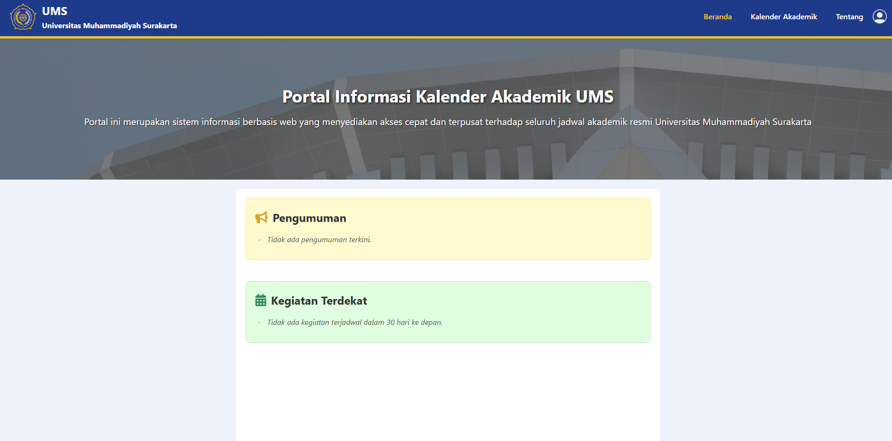
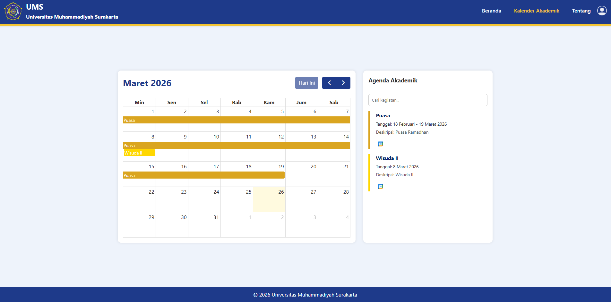

# KalenderAkademik-Capstone

## Preview Aplikasi

### Tampilan Beranda


### Tampilan Kalender


## Prasyarat
- Code editor (misalnya: Visual Studio Code).
- Python 3.8+ (terinstal di sistem).
- Node.js 18+ (terinstal di sistem).
- Redis Server (untuk Celery).
- MySQL atau SQLite (opsional, tergantung konfigurasi database).

## Langkah-langkah Instalasi dan Pengaturan

### 1. Buka Proyek
- Buka proyek ini menggunakan code editor misalnya VSCode.
- Pastikan kamu berada di direktori root proyek (`KalenderAkademik-capstone`).

### 2. Siapkan Lingkungan Virtual
- Buka terminal bawaan VSCode (klik ikon "+" di sisi kanan atas terminal, pilih "Command Prompt" atau shell yang sesuai).
- Buat dan aktifkan lingkungan virtual dengan perintah berikut:
  ```bash
  python -m venv env
  env\Scripts\activate  # Untuk Windows
  # Atau gunakan: source env/bin/activate  # Untuk macOS/Linux
  ```

### 3. Pindah Direktori dan Instal Dependensi Python
- Pindah ke direktori proyek:
  ```bash
  cd kalenderAkademik
  ```
- Instal modul yang diperlukan:
  ```bash
  pip install django
  pip install djangorestframework
  pip install requests
  pip install celery[redis]
  pip install pytz
  pip install django-jazzmin
  pip install mysqlclient  # Opsional, jika menggunakan MySQL
  ```

### 4. Instal Redis dan Node.js
- **Redis:**
  - Unduh dari: [Redis untuk Windows](https://github.com/microsoftarchive/redis/releases/download/win-3.0.504/Redis-x64-3.0.504.msi).
  - Instal seperti biasa. Pastikan layanan Redis berjalan (jalankan `redis-server` di terminal terpisah).
- **Node.js:**
  - Unduh dari: [Node.js v22.15.0](https://nodejs.org/dist/v22.15.0/node-v22.15.0-x64.msi).
  - Instal seperti biasa. Verifikasi dengan menjalankan `node -v` dan `npm -v` di terminal.

### 5. Konfigurasi Database
- Buka file `settings.py` di folder proyek (`kalenderAkademik`).
- Sesuaikan konfigurasi database sesuai kebutuhan:
  - **Untuk SQLite (default):**
    ```python
    DATABASES = {
        'default': {
            'ENGINE': 'django.db.backends.sqlite3',
            'NAME': BASE_DIR / 'db.sqlite3',
        }
    }
    ```
  - **Untuk MySQL:**
    ```python
    DATABASES = {
        'default': {
            'ENGINE': 'django.db.backends.mysql',
            'NAME': 'nama_database_anda',
            'USER': 'root',
            'PASSWORD': 'kata_sandi_anda',
            'HOST': 'localhost',
            'PORT': '',
            'OPTIONS': {
                'charset': 'utf8mb4'
            }
        }
    }
    ```
- Pastikan database sudah dibuat jika menggunakan MySQL (misalnya, via phpMyAdmin atau perintah MySQL).

### 6. Sinkronisasi Database
- Jalankan perintah berikut untuk membuat tabel berdasarkan model:
  ```bash
  python manage.py makemigrations
  python manage.py migrate
  ```

- Buat admin dengan kode berikut:
  ```bash
  python manage.py createsuperuser
  python manage.py populate_kalender //Opsional isi database otomatis periode 2023/2024-2024/2025
  ```

### 7. Jalankan Komponen Proyek
- Pastikan semua komponen berjalan di terminal terpisah dan mengaktifkan virtual(ENV/env):
  1. **Jalankan Server Django:**
     - Buka terminal baru di direktori root proyek (`KalenderAkademik-capstone/kalenderAkademik`):
       ```bash
       python manage.py runserver
       ```
       Cek localhost di browser http://localhost:8000/
  2. **Cek Redis apakah berjalan:**
     - Cek service:
       ```bash
       WIN + R
       Input: services.msc
       Cari name redist, pastikan status running
       ```
  3. **Jalankan Celery Beat dan Worker:**
     - Buka dua terminal baru di direktori root proyek (`KalenderAkademik-capstone/kalenderAkademik`):
       - Semua terminal harus mengaktifkan env(env\scripts\activate)
       - Terminal 1 (Celery Beat):
         ```bash
         celery -A kalenderAkademik beat --loglevel=info
         ```
       - Terminal 2 (Celery Worker):
         ```bash
         celery -A kalenderAkademik worker --loglevel=info --pool=threads
         ```

  4. **Jalankan Server WhatsApp (Node.js):**
     - Buka terminal baru, masuk ke direktori `whatsapp-server`:
       ```bash
       cd whatsapp-server
       npm install express whatsapp-web.js qrcode-terminal body-parser cors  # Instal dependensi Node.js
       node server.js
       ```
     - **Autentikasi WhatsApp:** Saat pertama kali menjalankan `server.js`, sebuah QR code akan muncul di terminal. Buka aplikasi WhatsApp di ponsel, masuk ke menu "Perangkat Tertaut" (Linked Devices), lalu scan QR code tersebut untuk menghubungkan akun WhatsApp.

### 8. Pengujian
- Buka browser dan akses `http://127.0.0.1:8000/admin/` untuk masuk ke Django admin.
- Login dengan superuser (buat jika belum ada dengan `python manage.py createsuperuser`).
- Tambahkan kegiatan dan notifikasi via admin, lalu periksa apakah notifikasi dikirim sesuai jadwal (1 hari dan 1 jam sebelum `tgl_mulai`).

## Catatan Penting
- Pastikan semua terminal tetap terbuka selama pengujian.
- Jika ada error, periksa log di terminal Celery atau server Node.js.
- QR code untuk WhatsApp hanya perlu di-scan sekali, kecuali jika sesi logout atau server di-restart.

## Lisensi
MIT License.

---


